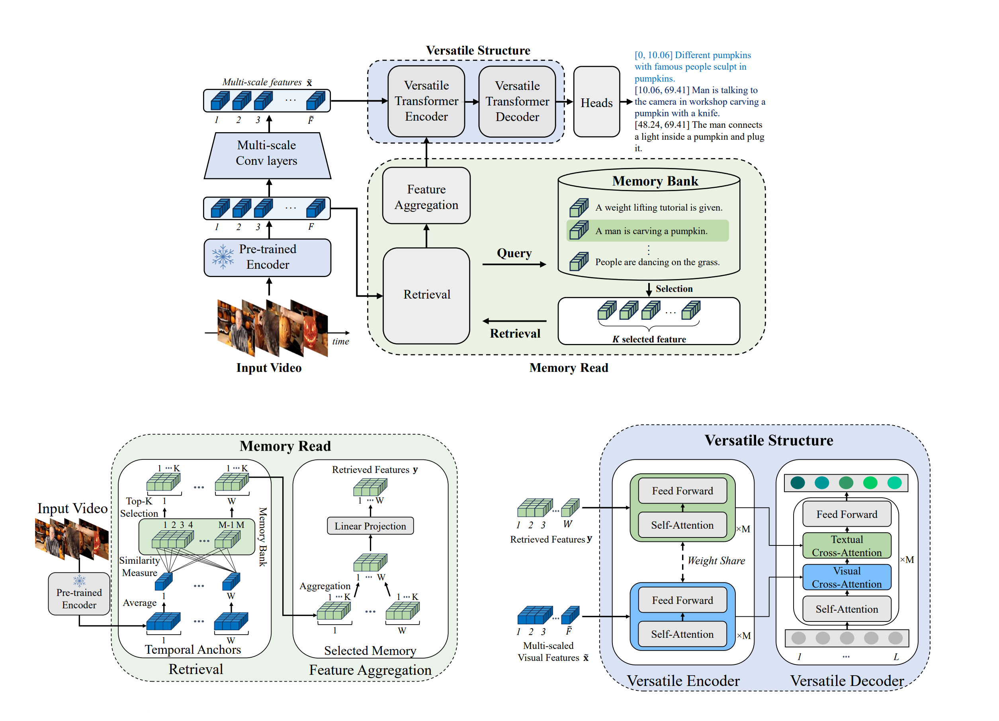

# [CVPR2024] Do you remember? Dense Video Captioning with Cross-Modal Memory Retrieval

This repo is a official codebase for our paper accepted to the CVPR2024. 
The aim of this repo is to help other researchers.

[Paper](https://arxiv.org/abs/2404.07610) 

## Introduction

There has been significant attention to the research on dense video captioning, which aims to automatically localize and caption all events within untrimmed video. Several studies introduce methods by designing dense video captioning as a multitasking problem of event localization and event captioning to consider inter-task relations. However, addressing both tasks using only visual input is challenging due to the lack of semantic content. In this study, we address this by proposing a novel framework called as CM2 inspired by the cognitive information processing of humans. Our model utilizes external memory to incorporate prior knowledge. The memory retrieval method is proposed with cross-modal video-to-text matching. To effectively incorporate retrieved text features, the versatile encoder and the decoder with visual and textual cross-attention modules are designed. Comparative experiments have been conducted to show the effectiveness of the proposed method on ActivityNet Captions and YouCook2 datasets. Experimental results show promising performance of our model without extensive pretraining from a large video dataset.

## Preparation
Environment: Linux, Python>=3.8, PyTorch>=1.7.1  

1. Create virtual environment by conda

```bash
conda  create  -n  cm2  python=3.8
source  activate  cm2
conda  install  pytorch==1.7.1  torchvision==0.8.2  torchaudio==0.7.2  cudatoolkit=11.0  -c  pytorch
conda  install  ffmpeg
pip  install  -r  requirement.txt
pip  install  git+https://github.com/openai/CLIP.git
```

2. Compile the deformable attention layer (requires GCC >= 5.4).

```bash
cd  CM2/ops
sh  make.sh
```  

3. Prepare resources to run our code.

	#### Data

	Download anet clip feature ([GoogleDrive](https://drive.google.com/file/d/1v08rs9Hwqh3XIM-8u8rRcFZc3HWUtJo_/view?usp=sharing)). 
	Then put it in data folder like 'CM2/data/anet/features/clipvitl14.pth'

	Download yc2 clip feature ([GoogleDrive](https://drive.google.com/file/d/17H_lxSKFve57kHpkAD7pcYS7ijHIy4-M/view?usp=sharing)). 
	Then put it in data folder like 'CM2/data/yc2/features/clipvitl14.pth'
	  
	#### Pre-trained model

	Download pre-trained model for anet ([GoogleDrive](https://drive.google.com/file/d/1ZaqDBcRYgEgn_Y10tKNdvJwdyYr3mgID/view?usp=sharing)). 
	Then put it in data folder like 'CM2/save/anet_clip_cm2_best/model-best.pth'
	  
	Download pre-trained model for yc2 ([GoogleDrive](https://drive.google.com/file/d/1swQfs7f9G5RYgiHD2BKUGobpKZWjCIrr/view?usp=sharing)). 
	Then put it in data folder like 'CM2/save/yc2_clip_cm2_best/model-best.pth'

	#### Memory Bank

	Download 3 memory files for anet ([GoogleDrive](https://drive.google.com/drive/folders/1HYkLWTO2qFdzl1P3pR7fW7nkE6eS-SbR?usp=sharing)). 
	Then put it in data folder like 'CM2/bank/anet/clip/*'

	Download 3 memory files for yc2 ([GoogleDrive](https://drive.google.com/drive/folders/1E8dMREMZZmzvyeFcyci2p0OmLkcIFKjg?usp=sharing)). 
	Then put it in data folder like 'CM2/bank/yc2/clip/*'

## Training CM2
  
Training ActivityNet Captions

```bash
cd  CM2
sh  train_ret_encdec_clip_anet.sh
```

Training YouCook2
```bash
cd  CM2
sh  train_ret_encdec_clip_yc2.sh
```
  
## Evaluation CM2
  
Evaluate ActivityNet Captions

```bash
cd  CM2
sh  eval_ret_encdec_clip_anet.sh
```

Evaluate YouCook2

```bash
cd  CM2
sh  eval_ret_encdec_clip_yc2.sh
```

## Citation


## Acknowledgement

The implementation of Deformable Transformer is mainly based on [Deformable DETR](https://github.com/fundamentalvision/Deformable-DETR). 
The implementation of the captioning head is based on [ImageCaptioning.pytorch](https://github.com/ruotianluo/ImageCaptioning.pytorch).
The implementation of the pipeline is mainly based on [PDVC](https://github.com/ttengwang/PDVC)
We thanks the authors for their efforts.
